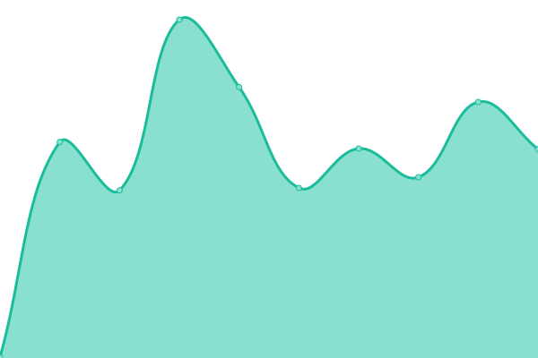

# [📈 Live Status](https://uptime.tiaui.co): <!--live status--> **🟩 All systems operational**

This repository contains the open-source uptime monitor and status page for [TiâuUî Lâu](https://tiaui.co), powered by [Upptime](https://github.com/upptime/upptime).

With [Upptime](https://upptime.js.org), you can get your own unlimited and free uptime monitor and status page, powered entirely by a GitHub repository. We use [Issues](https://github.com/watain666/upptime/issues) as incident reports, [Actions](https://github.com/watain666/upptime/actions) as uptime monitors, and [Pages](https://uptime.tiaui.co) for the status page.

<!--start: status pages-->
<!-- This summary is generated by Upptime (https://github.com/upptime/upptime) -->
<!-- Do not edit this manually, your changes will be overwritten -->
<!-- prettier-ignore -->
| URL | Status | History | Response Time | Uptime |
| --- | ------ | ------- | ------------- | ------ |
|  [Always Indigo](https://tiaui.co) | 🟩 Up | [always-indigo.yml](https://github.com/watain666/upptime/commits/HEAD/history/always-indigo.yml) | 

 259ms
     
 | 

<a href="https://uptime.tiaui.co/history/always-indigo">100.00%</a>
    

|  [One Drive](https://d.tiaui.co/) | 🟩 Up | [one-drive.yml](https://github.com/watain666/upptime/commits/HEAD/history/one-drive.yml) | 

 954ms
     
 | 

<a href="https://uptime.tiaui.co/history/one-drive">100.00%</a>
    

|  [FETN](https://fetnto.blogspot.com/) | 🟩 Up | [fetn.yml](https://github.com/watain666/upptime/commits/HEAD/history/fetn.yml) | 

 315ms
     
 | 

<a href="https://uptime.tiaui.co/history/fetn">89.34%</a>
    

|  [O͘màmà](https://omama.to/) | 🟩 Up | [omama.yml](https://github.com/watain666/upptime/commits/HEAD/history/omama.yml) | 

 523ms
     
 | 

<a href="https://uptime.tiaui.co/history/omama">100.00%</a>
    

|  [Tâijī chhân](https://ji.taioan.org/) | 🟩 Up | [taiji-chhan.yml](https://github.com/watain666/upptime/commits/HEAD/history/taiji-chhan.yml) | 

 834ms
     
 | 

<a href="https://uptime.tiaui.co/history/taiji-chhan">100.00%</a>
    

|  [Ginger's portfolio](https://bginger.art/) | 🟩 Up | [ginger-s-portfolio.yml](https://github.com/watain666/upptime/commits/HEAD/history/ginger-s-portfolio.yml) | 

 224ms
     
 | 

<a href="https://uptime.tiaui.co/history/ginger-s-portfolio">100.00%</a>
    

<!--end: status pages-->

[**Visit our status website →**](https://uptime.tiaui.co)

## 📄 License

- Powered by: [Upptime](https://github.com/upptime/upptime)
- Code: [MIT](./LICENSE) © [TiâuUî Lâu](https://tiaui.co)
- Data in the `./history` directory: [Open Database License](https://opendatacommons.org/licenses/odbl/1-0/)
